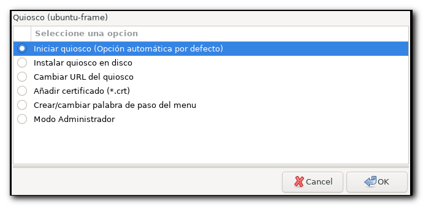
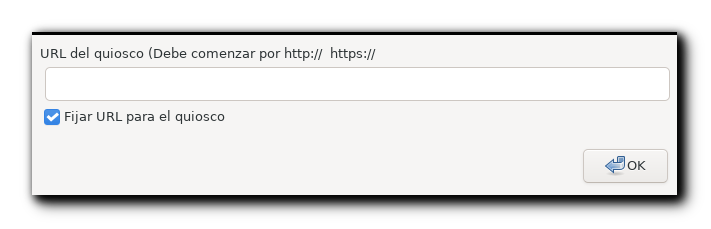
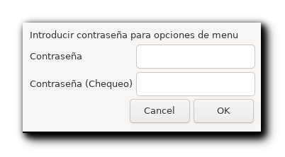
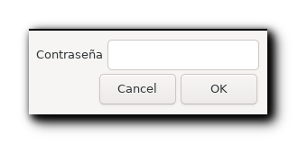
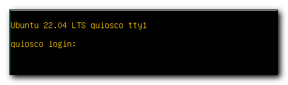

# install_frame_webkit_kiosk.sh 

Script para desplegar la interfaz gráfica de un quiosco interactivo  utilizando el paquete snap [**wpe-webkit-mir-kiosk**](https://gitlab.com/glancr/wpe-webkit-snap) mediante [**Ubuntu-Frame**](https://mir-server.io/ubuntu-frame) en un servidor [**Ubuntu Server LTS**](https://ubuntu.com/download/server) (probado en Ubuntu Server LTS 22.04 sin entorno gráfico).

- [**Ubuntu-Frame**](https://mir-server.io/ubuntu-frame) es una shell para implementar aplicaciones gráficas para kioskos interactivos, soluciones de señalización digital, etc. La shell proporciona comunicaciones seguras cliente-servidor utilizando el protocolo ```Wayland``` y las aplicaciones solo pueden comunicarse a través de un socket seguro lo cual reduce los vectores de ataque para el código malicioso (Ubuntu-Frame está soportado durante 10 años)

- [**wpe-webkit-mir-kiosk**](https://gitlab.com/glancr/wpe-webkit-snap) es un fork de [**WPE WebKit**](https://wpewebkit.org/) en un paquete snap para usar en quioscos a pantalla completa.

# Instalación

Pasos a realizar para desplegar el quiosco en ***Ubuntu Server LTS***

| Descripción | Acción |
| --- | ---- |
| Clonar repositorio | ```git clone https://github.com/fmbrieva/frame-webkit-kiosk.git```|
| Ejecutar script de instalación | ```frame-webkit-kiosk/install_frame_webkit_kiosk.sh```|

Después de ejecutar el script de instalación se reiniciará el sistema y podrá configurar el quiosco


  
Para facilitar el despiegle de quioscos con wpe-webkit-mir-kiosk se proporciona un quiosco configurado en dos formatos

- Imagen para desplegar un quiosco en modo persistente desde un **pendrive**
- Imagen ISO para instalar un servidor Ubuntu Server LTS 22.04 y automatizar la instalación del quiosco

## Imagen autoarrancable persistente 

Imagen persistente autoarrancable (formato: IMG) para desplegar el quiosco en modo persistente en Ubuntu Server (22.04 LTS - Jammy Jellyfish)

- [**frame-webkit-kiosk v00r34_persistente.img**](https://drive.google.com/file/d/1jdU6VU5s2qzEto4L5-AjsCOtCc9z-Y48/view?usp=sharing) (10/07/2022) 

Para desplegar la imagen en un pendrive puede utilizar Rufus (https://rufus.ie/). 
Si el sistema no arranca en equipos con el ```firmware UEFI``` puede ser debido a que en la BIOS está activada la opción **Secure Boot**.


# Pantallas

  
    
  
  
  

  


